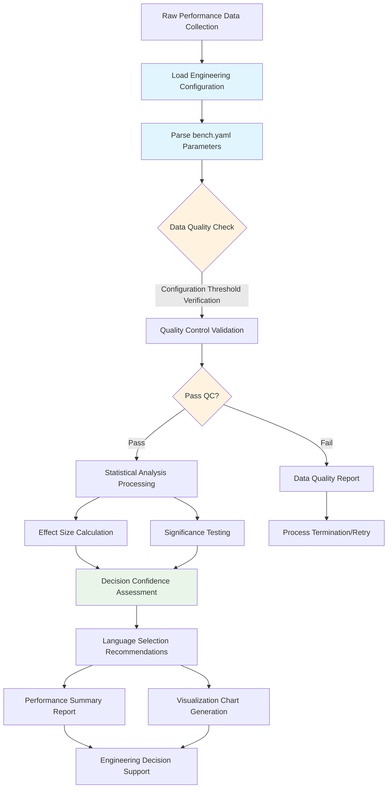

# 🎯 WebAssembly Benchmark Project Statistical Design Implementation Guide

> **Last Updated**: 2025-09-27
> **Target Audience**: Core development team, architecture decision makers, new developers
> **Scope**: Rust vs TinyGo language selection decision support system architecture and implementation

---

## 📋 **Project Background and Objectives**

### **Problem Background**

The WebAssembly Benchmark project aims to provide developers with data-driven language selection decision support, focusing on comparing Rust vs TinyGo performance in WebAssembly compilation scenarios.

### **Core Objectives**

- **Primary Users**: Developers
- **Use Cases**: Select Rust vs TinyGo for WebAssembly compilation based on data rather than guesswork
- **Quality Requirements**: Engineering-grade reliability, not academic-level rigor
- **System Standards**: Balance statistical accuracy with practical usability

### **Core Features (✅ Implemented)**

1. **Performance Benchmarks**: Mandelbrot calculation, JSON parsing, matrix multiplication WASM tasks (`tasks/` directory)
2. **Statistical Analysis**: Welch's t-test and Cohen's d effect size analysis (`analysis/statistics.py`)
3. **Quality Control**: IQR outlier detection and coefficient of variation validation (`analysis/qc.py`)
4. **Decision Support**: Comprehensive decision reports and language recommendations (`analysis/decision.py`)
5. **Visualization Analysis**: 4 statistical charts and interactive HTML reports (`analysis/plots.py`)
6. **Configuration Management**: Engineering-grade configuration parsing and validation (`analysis/config_parser.py`)

---

## 🏆 **Component Importance Analysis and Priority**

### **🥇 First Priority: Statistical Validation Testing**

**Importance Rating**: ⭐⭐⭐⭐⭐ (Critical)

#### **Why Most Important**

- **Decision Reliability**: Distinguish real performance differences vs measurement noise
- **Risk Control**: Avoid making wrong language choices based on random fluctuations
- **Confidence Quantification**: Provide statistical significance and effect sizes to help developers understand result credibility
- **Cost-Benefit**: Prevent refactoring costs from wrong choices

#### **Missing Risk Assessment**

```text
High-risk scenarios:
- Choosing complex Rust based on 3% performance difference, but difference is actually noise
- Misjudging TinyGo's disadvantage in certain tasks, missing better choices
- Team making architecture decisions based on unreliable data, affecting long-term project development
```

### **🥈 Second Priority: Benchmark Validation Framework**

**Importance Rating**: ⭐⭐⭐⭐ (Important)

#### **Why Important**

- **Comparison Fairness**: Ensure Rust and TinyGo are tested under identical conditions
- **Implementation Correctness**: Detect algorithm implementation errors through hash validation
- **Result Reproducibility**: Guarantee result consistency across different runtime environments
- **Data Quality**: Early detection and flagging of abnormal data

#### **Simplification Space**

- Can be simplified to lightweight validation rather than complete academic framework
- Focus on key quality indicators, ignore edge cases

### **🥉 Third Priority: Performance Baseline**

**Importance Rating**: ⭐⭐ (Optional)

#### **Why Lower Priority**

- **Relative Comparison Orientation**: Developers care more about "Rust vs TinyGo" rather than absolute performance
- **Environment Dependency**: Baseline differences vary greatly across hardware, limited reference value
- **Can be Deferred**: Doesn't affect current language selection decisions
- **Maintenance Cost**: Requires continuous updates and calibration, low return on investment

---

## 📊 **System Architecture Design**

### **Data Processing Flow**



### **Core Component Architecture (✅ Actual Implementation)**

| Component | File | Function Description | Configuration Dependency | Status |
|-----------|------|---------------------|--------------------------|--------|
| **Configuration Management** | `configs/bench.yaml` | Engineering parameters and threshold settings | - | ✅ Complete Implementation |
| **Configuration Parser** | `analysis/config_parser.py` | Typed configuration loading and validation | All configuration nodes | ✅ Complete Implementation |
| **Data Models** | `analysis/data_models.py` | Complete data structure definitions | - | ✅ Complete Implementation |
| **Statistical Analysis** | `analysis/statistics.py` | StatisticalAnalysis class | `statistics.*` | ✅ Complete Implementation |
| **Quality Control** | `analysis/qc.py` | QualityController class | `qc.*` | ✅ Complete Implementation |
| **Decision Support** | `analysis/decision.py` | DecisionSummaryGenerator class | `statistics.*` | ✅ Complete Implementation |
| **Visualization** | `analysis/plots.py` | 4 charts + HTML report | `plots.*` | ✅ Complete Implementation |
| **Validation Framework** | `analysis/validation.py` | Cross-language hash validation | `validation.*` | ✅ Complete Implementation |
| **Common Utilities** | `analysis/common.py` | CLI and utility functions | - | ✅ Auxiliary Implementation |

#### **Actual Configuration Node Structure**

```yaml
# configs/bench.yaml actual structure
qc:                           # Quality control configuration
  max_coefficient_variation: 0.15
  outlier_iqr_multiplier: 1.5
  min_valid_samples: 30
  failure_rate: 0.1
  quality_invalid_threshold: 0.15
  quality_warning_threshold: 0.3
  rust_thresholds:
    max_coefficient_variation: 0.15
    extreme_cv_threshold: 0.5
  tinygo_thresholds:
    max_coefficient_variation: 0.3
    extreme_cv_threshold: 1.0

statistics:                   # Statistical analysis configuration
  confidence_level: 0.95
  significance_alpha: 0.05
  effect_size_thresholds: {small: 0.2, medium: 0.5, large: 0.8}
  minimum_detectable_effect: 0.3

plots:                        # Visualization configuration
  dpi_basic: 150
  dpi_detailed: 300
  output_format: "png"
  figure_sizes: {basic: [10, 6], detailed: [16, 12]}
  font_sizes: {default: 11, labels: 12, titles: 14}
  color_scheme: {rust: "#CE422B", tinygo: "#00ADD8"}

validation:                   # Validation configuration
  required_success_rate: 0.95
  hash_tolerance: 1e-8
  sample_limit: 1000
```

---

## 🔬 **Statistical Validation Testing Design**

### **Core Statistical Method Selection**

#### **Significance Testing: Welch's t-test**

**Mathematical Principles**:

Welch's t-test is used to compare two samples that may have unequal variances, more appropriate than standard t-test for performance data analysis.

**t Statistic Calculation**:

```math
t = (μ₁ - μ₂) / √(s₁²/n₁ + s₂²/n₂)
```

**Welch-Satterthwaite Degrees of Freedom**:

```math
df = (s₁²/n₁ + s₂²/n₂)² / [(s₁²/n₁)²/(n₁-1) + (s₂²/n₂)²/(n₂-1)]
```

**Confidence Interval**:

```math
(μ₁ - μ₂) ± t_critical × √(s₁²/n₁ + s₂²/n₂)
```

#### **Effect Size Calculation: Cohen's d**

**Mathematical Principles**:

Cohen's d quantifies the actual difference size between two data groups, standardizing the mean difference.

**Formula**:

```math
d = (μ₁ - μ₂) / s_pooled

Where pooled standard deviation:
s_pooled = √[((n₁-1)×s₁² + (n₂-1)×s₂²) / (n₁+n₂-2)]
```

**Effect Size Interpretation Standards**:

- |d| < 0.2: Negligible (negligible)
- 0.2 ≤ |d| < 0.5: Small effect (small effect)
- 0.5 ≤ |d| < 0.8: Medium effect (medium effect)
- |d| ≥ 0.8: Large effect (large effect)

### **Data Quality Validation**

**Validation Principles**:

1. **Sample Size Check**: n ≥ 5 (minimum), recommended n ≥ 30
2. **Coefficient of Variation Limit**: CV = σ/μ < 0.5 (performance stability)
3. **Outlier Detection**: IQR method, mark as outliers beyond Q1 - 1.5×IQR or Q3 + 1.5×IQR
4. **Success Rate Threshold**: Success rate > 80%

**Data Quality Rating Standards**:

- **Valid**: No critical issues, data can be used for decisions
- **Warning**: Quality issues exist but don't affect basic analysis
- **Invalid**: Critical quality issues, cannot be used for language selection decisions

---

## 🔍 **Technical Implementation Details**

### **1. Configuration Parser Module (analysis/config_parser.py)**

#### **Actual Implementation Architecture**

```python
class ConfigParser:
    """Configuration parser for engineering-grade benchmark analysis.

    NOTE: implementation lives in `analysis/config_parser.py`. The doc here
    shows the public API surface (signatures and brief descriptions) only.
    """

    def __init__(self, config_path: str = "configs/bench.yaml"):
        """Initialize configuration parser with a path to the bench YAML file."""
        pass

    def load(self) -> "ConfigParser":
        """Load and validate the YAML configuration. Returns self for chaining."""
        pass

    def get_qc_config(self) -> QCConfiguration:
        """Return typed QC configuration (QCConfiguration)."""
        pass

    def get_stats_config(self) -> StatisticsConfiguration:
        """Return typed statistical configuration (StatisticsConfiguration)."""
        pass

    def get_plots_config(self) -> PlotsConfiguration:
        """Return typed plots configuration (PlotsConfiguration)."""
        pass

    def get_validation_config(self) -> ValidationConfiguration:
        """Return typed validation configuration (ValidationConfiguration)."""
        pass
```

#### **Type Safety Features**

- **Strongly Typed Configuration**: Uses configuration types from `data_models.py`
- **Validation Mechanisms**: Configuration file structure and required field validation
- **Default Value Handling**: Reasonable defaults for missing parameters
- **Error Handling**: Detailed configuration error messages

#### **Configuration-Driven Features**

- **Centralized Management**: All module configuration parameters managed uniformly
- **Type Safety**: Configuration value type validation and default handling
- **Hot Reload**: Support runtime configuration updates (optional)
- **Environment Adaptation**: Support different environment configuration files

### **2. Statistical Analysis Module (analysis/statistics.py)**

#### **Statistical Analysis Implementation Architecture**

```python
class StatisticalAnalysis:
    """Statistical analysis engine for benchmark performance comparison.

    Only the public API and helper signatures are shown here. See
    `analysis/statistics.py` for the full implementation.
    """

    def __init__(self, stats_config: StatisticsConfiguration):
        """Initialize engine with a StatisticsConfiguration object."""
        pass

    def welch_t_test(self, group1: list[float], group2: list[float]) -> TTestResult:
        """Perform Welch's t-test and return a TTestResult.

        - Validates inputs
        - Uses Welch-Satterthwaite df
        - Returns p-value, t-statistic, CI and significance flag
        """
        pass

    def cohens_d(self, group1: list[float], group2: list[float]) -> EffectSizeResult:
        """Compute Cohen's d and return an EffectSizeResult including interpretation."""
        pass

    def generate_task_comparison(
        self, rust_result: TaskResult, tinygo_result: TaskResult
    ) -> ComparisonResult:
        """Produce a comprehensive ComparisonResult for a single task/scale.

        Performs per-metric comparisons (execution time, memory) and computes
        an overall confidence assessment.
        """
        pass

    # Helper / private API (signatures only)
    def _validate_groups(self, group1: list[float], group2: list[float], method_name: str) -> None:
        """Validate input groups used by statistical methods."""
        pass

    def _get_basic_stats(self, data: list[float]) -> tuple[int, float, float]:
        """Return (n, mean, variance) using a numerically stable method."""
        pass

    def _calculate_welch_t_stats(self, mean1: float, mean2: float, var1: float, var2: float, n1: int, n2: int) -> float:
        """Compute Welch's t-statistic for unequal variances."""
        pass

    def _calculate_welch_degrees_freedom(self, var1: float, var2: float, n1: int, n2: int) -> float:
        """Compute Welch-Satterthwaite degrees of freedom."""
        pass

    def _calculate_p_value(self, t_stat: float, df: float) -> float:
        """Return two-tailed p-value for t-statistic using t-distribution."""
        pass

    def _confidence_interval(self, group1: list[float], group2: list[float]) -> tuple[float, float]:
        """Compute CI for the difference in means at configured confidence level."""
        pass

    def _calculate_pooled_std(self, std1: float, std2: float, n1: int, n2: int) -> float:
        """Return pooled standard deviation used by Cohen's d."""
        pass

    def _calculate_cohens_d_value(self, mean1: float, mean2: float, pooled_std: float) -> float:
        """Compute the raw Cohen's d value."""
        pass

    def _classify_effect_size(self, cohen_d: float) -> EffectSize:
        """Classify Cohen's d magnitude according to thresholds."""
        pass

    def _generate_effect_size_interpretation(self, cohens_d_value: float, abs_d: float, meets_mde: bool) -> str:
        """Compose a human-readable interpretation of effect size and MDE status."""
        pass

    # Additional helpers for multi-metric processing (signatures only)
    def _extract_performance_data(self, rust_result: TaskResult, tinygo_result: TaskResult) -> tuple[PerformanceStatistics, PerformanceStatistics]:
        """Extract and summarize execution time and memory statistics."""
        pass

    def _extract_metrics_from_samples(self, samples: list[BenchmarkSample]) -> tuple[list[float], list[float]]:
        """Extract execution times and memory usage lists from samples."""
        pass

    def _perform_metric_comparisons(self, rust_result: TaskResult, tinygo_result: TaskResult) -> tuple[MetricComparison, MetricComparison]:
        """Run t-tests and effect size calculations for each supported metric."""
        pass

    def _calculate_complete_stats(self, data: list[float]) -> StatisticalResult:
        """Return descriptive statistics (count, mean, std, median, q1, q3, iqr, cv)."""
        pass

    def _calculate_complete_stats_optimized_summary(self, comparison_results: list[ComparisonResult]) -> dict[str, Any]:
        """Produce an optimized summary from a list of comparison results."""
        pass

    def _calculate_complete_stats_memory(self, data: list[float]) -> StatisticalResult:
        """Memory-optimized path to compute descriptive statistics."""
        pass

    def _create_metric_comparison(self, metric_type: MetricType, rust_data: list[float], tinygo_data: list[float]) -> MetricComparison:
        """Create a MetricComparison object containing test and effect size info."""
        pass

    def _generate_confidence_level(self, exec_comparison: MetricComparison, memory_comparison: MetricComparison) -> str:
        """Aggregate metric-level evidence into an overall confidence level string."""
        pass

    # Top-level CLI helpers are implemented in the real module; omitted here.
```

#### **Core Features**

- **Numerical Stability**: Welford algorithm for mean and variance calculation
- **Strongly Typed Returns**: All methods return structured data types
- **Multi-Metric Support**: Analyze execution time and memory usage simultaneously
- **MDE Assessment**: Minimum detectable effect size judgment
- **Scientific Computing**: Use scipy for precise statistical calculations

#### **Engineering Features**

- **Simplified Statistical Methods**: Focus on core comparison analysis, avoid overly complex academic features
- **Practical Significance Thresholds**: α = 0.05 (engineering standard)
- **Effect Size Classification**: Practical Cohen's d thresholds (small=0.3, medium=0.6, large=1.0)
- **Decision Support**: Direct language selection recommendations and confidence assessments

### **3. Quality Control Module (analysis/qc.py)**

#### **Quality Control Implementation Architecture**

```python
class QualityController:
    """Data quality control and validation for the benchmark analysis pipeline.

    Only signatures and short descriptions are kept here. See `analysis/qc.py`
    for the full implementation.
    """

    def __init__(self, benchmark_results: list[BenchmarkResult], qc_config: QCConfiguration):
        """Initialize with raw benchmark results and a QCConfiguration."""
        pass

    def validate_and_clean(self) -> CleanedDataset:
        """Run the full QC pipeline: outlier detection, grouping, and cleaning."""
        pass

    def _extract_all_samples(self) -> list[BenchmarkSample]:
        """Return a flattened list of all BenchmarkSample objects from inputs."""
        pass

    def _group_samples_by_task(self, all_samples: list[BenchmarkSample]) -> dict[tuple[str, str, str], list[BenchmarkSample]]:
        """Group samples by (task, language, scale)."""
        pass

    def _process_task_groups(self, task_groups: dict[tuple[str, str, str], list[BenchmarkSample]]) -> tuple[list[TaskResult], list[BenchmarkSample]]:
        """Process groups to remove outliers and create TaskResult objects."""
        pass

    def _partition_samples_by_success(self, samples: list[BenchmarkSample]) -> tuple[list[BenchmarkSample], list[BenchmarkSample]]:
        """Partition samples into successful and failed lists."""
        pass

    def _generate_group_key(self, task: str, language: str, scale: str) -> str:
        """Return a consistent string key for a task-language-scale group."""
        pass

    def _create_cleaned_dataset(self, cleaned_task_results: list[TaskResult], all_removed_outliers: list[BenchmarkSample]) -> CleanedDataset:
        """Assemble and return the CleanedDataset object."""
        pass

    def detect_outliers(self, samples: list[BenchmarkSample]) -> tuple[list[BenchmarkSample], list[BenchmarkSample]]:
        """Detect and return (cleaned_samples, outliers) using the IQR method."""
        pass

    def calculate_quality_metrics(self, task_result: TaskResult) -> QualityMetrics:
        """Compute per-metric quality metrics (mean, std, CV, success rate, issues)."""
        pass

    def calculate_overall_quality(self, task_results: list[TaskResult]) -> QualityAssessment:
        """Aggregate group-level qualities into a QualityAssessment summary."""
        pass
```

#### **Quality Control Constants**

```python
class QCConstants:
    """Constants for quality control operations."""

    # Percentiles for IQR calculation
    Q1_PERCENTILE = 0.25
    Q3_PERCENTILE = 0.75

    # Quality thresholds
    EXTREME_CV_MULTIPLIER = 2.0
    DIVISION_BY_ZERO_EPSILON = 1e-9
    MINIMUM_IQR_SAMPLES = 4

    # File patterns
    META_FILE_PATTERN = "meta"
    JSON_FILE_PATTERN = "*.json"

    # Output file names
    QC_REPORT_FILENAME = "quality_control_report.json"
    CLEANED_DATASET_FILENAME = "cleaned_dataset.json"

    # Report formatting
    TITLE_SEPARATOR = "=" * 60
    DEFAULT_JSON_INDENT = 2
```

#### **Language-Specific Thresholds**

- **Rust Thresholds**: CV ≤ 15%, extreme CV ≤ 50%
- **TinyGo Thresholds**: CV ≤ 30%, extreme CV ≤ 100% (GC impact)

#### **Configuration-Driven Engineering Standards**

- **Coefficient of Variation Threshold**: 15% (relaxed engineering standard)
- **Minimum Sample Size**: 30 valid samples (practical standard)
- **Outlier Detection**: 1.5×IQR standard method
- **Simplified Quality Metrics**: Focus on analysis reliability

### **4. Visualization Module (analysis/plots.py)**

#### **Complete Chart System**

The project implements **4 statistical charts** and **interactive HTML reports**:

1. **`execution_time_comparison.png`**: Execution time comparison bar chart
   - Mean, median, error bars
   - Statistical significance markers
   - Cohen's d effect size annotations

2. **`memory_usage_comparison.png`**: Memory usage comparison chart
   - Memory consumption pattern analysis
   - GC impact visualization

3. **`effect_size_heatmap.png`**: Effect size heatmap
   - Cohen's d value matrix
   - Color-coded significance levels

4. **`distribution_variance_analysis.png`**: Distribution variance analysis
   - Box plots showing performance consistency
   - Variance difference patterns

5. **`decision_summary.html`**: Interactive decision report
   - Comprehensive analysis results
   - Language recommendations and confidence levels
   - Detailed statistical data tables

#### **Configuration-Driven Design**

```python
# From the plots configuration node: Visualization generator signatures only
class VisualizationGenerator:
    """Chart and visualization generator for benchmark analysis results.

    Documentation here shows only method signatures and purpose. Full
    implementations live in `analysis/plots.py`.
    """

    def __init__(self, plots_config: PlotsConfiguration):
        """Initialize with a PlotsConfiguration."""
        pass

    def _setup_plotting_style(self) -> None:
        """Apply matplotlib rcParams and theme settings."""
        pass

    def _validate_comparison_data(self, comparisons: list[ComparisonResult], metric_type: str) -> None:
        """Validate that comparison results include the required metric data."""
        pass

    def _extract_comparison_statistics(self, comparisons: list[ComparisonResult], metric_type: str) -> dict:
        """Extract arrays of means, medians, errors, CVs and labels for plotting."""
        pass

    def _create_comparison_bar_chart(self, ax, data: dict, metric_label: str) -> np.ndarray:
        """Draw grouped bar chart with means, error bars and median markers."""
        pass

    def _add_significance_markers(self, ax, data: dict, comparisons: list[ComparisonResult], metric_type: str) -> None:
        """Annotate chart with simple significance markers when evidence is strong."""
        pass

    def _create_comparison_legend(self, ax, metric_type: str = "execution_time") -> None:
        """Compose a compact legend for comparison charts."""
        pass

    def _add_statistical_note(self, fig, comparisons: list[ComparisonResult], metric_type: str) -> None:
        """Add a summary note below the figure describing test counts and winners."""
        pass

    def _save_plot(self, output_path: str) -> str:
        """Persist the current matplotlib figure to disk and return the path."""
        pass

    def _create_execution_time_comparison(self, comparisons: list[ComparisonResult], output_path: str = "reports/plots/execution_time_comparison.png") -> str:
        """Generate execution time comparison plot and save it to output_path."""
        pass

    def _create_memory_usage_comparison(self, comparisons: list[ComparisonResult], output_path: str = "reports/plots/memory_usage_comparison.png") -> str:
        """Generate memory usage comparison plot and save it to output_path."""
        pass

    def _create_effect_size_heatmap(self, comparisons: list[ComparisonResult], output_path: str = "reports/plots/effect_size_heatmap.png") -> str:
        """Generate Cohen's d heatmap across tasks and metrics."""
        pass

    def _create_distribution_variance_analysis(self, comparisons: list[ComparisonResult], output_path: str = "reports/plots/distribution_variance_analysis.png") -> str:
        """Generate distribution and variance box-plot analysis and save it."""
        pass

    def _extract_box_plot_data(self, comparisons: list[ComparisonResult]) -> dict:
        """Build structured box-plot statistics for all comparisons."""
        pass

    def _create_box_stats(self, stats) -> dict:
        """Return a dict with median, q1, q3, whislo, whishi and mean for bxp()."""
        pass

    def _create_optimized_box_plots(self, ax, data: dict, ylabel: str) -> None:
        """Render optimized side-by-side box plots with CV annotations."""
        pass

    def _create_distribution_legend(self, fig) -> None:
        """Render legend for the distribution/box-plot figure."""
        pass

    def _add_distribution_summary_note(self, fig, comparisons: list[ComparisonResult]) -> None:
        """Add a textual summary about variance, CV and stability below the plot."""
        pass

    def _extract_stability_insights(self, comparisons: list[ComparisonResult]) -> dict:
        """Compute aggregate stability metrics (stability_score, high_variance_ratio, etc.)."""
        pass

    def _create_decision_summary_panel(self, comparisons: list[ComparisonResult], output_path: str = "reports/plots/decision_summary.html") -> str:
        """Render a decision summary HTML page from a template and saved plots."""
        pass

    def _configure_fonts(self):
        """Configure font family and fallbacks for matplotlib."""
        pass
```

### **5. Decision Support Module (analysis/decision.py)**

#### **Comprehensive Decision System**

```python
class DecisionSummaryGenerator:
    """Decision support generator for Rust vs TinyGo selection.

    The full implementation is in `analysis/decision.py`. Here we show the
    constructor and key public/private method signatures used by the rest of
    the system.
    """

    DEFAULT_CONFIDENCE_LEVEL = 0.95
    SMALL_EFFECT_SIZE = 0.2
    MEDIUM_EFFECT_SIZE = 0.5
    LARGE_EFFECT_SIZE = 0.8

    def __init__(self, logger: Optional[logging.Logger] = None) -> None:
        """Initialize the generator with an optional logger."""
        pass

    def generate_decision_report(self, comparison_results: list[ComparisonResult], output_dir: Path) -> Path:
        """Produce and save an HTML decision report based on comparison results."""
        pass

    def _determine_overall_recommendation(self, comparison_results: list[ComparisonResult]) -> str:
        """Aggregate per-task recommendations into a single overall recommendation."""
        pass

    def _calculate_confidence_score(self, comparison_results: list[ComparisonResult]) -> float:
        """Compute a 0..1 confidence score using p-values, effect sizes and QC metrics."""
        pass
```

#### **Decision Logic Hierarchy**

1. **Task-level Decisions**: Language recommendations for individual tasks
2. **Metric-level Analysis**: execution_time vs memory_usage
3. **Comprehensive Assessment**: Overall recommendations across multiple tasks and metrics
4. **Confidence Quantification**: Credibility scoring based on statistical evidence

#### **Design Principles**

- **Simple and Direct**: Focus only on core decision logic
- **Easy to Understand**: Use emojis and concise text
- **Fast Implementation**: Minimal code and dependencies

---

## ⚙️ **Configuration Management**

### **Actual Configuration File Structure (configs/bench.yaml)**

```yaml
# Engineering-Grade WebAssembly Benchmark Configuration
# Simplified for engineering reliability, not academic rigor
# Focus: Practical Rust vs TinyGo performance comparison for engineering decisions

experiment:
  name: "Rust vs TinyGo WebAssembly Performance Comparison"
  version: "2.1"
  description: "Engineering-focused performance comparison for language selection decisions"

# Simplified measurement parameters for engineering reliability
environment:
  warmup_runs: 15
  measure_runs: 50
  repetitions: 4
  timeout: 1800

# Engineering-focused quality control
qc:
  max_coefficient_variation: 0.15
  outlier_iqr_multiplier: 1.5
  min_valid_samples: 30
  failure_rate: 0.1
  quality_invalid_threshold: 0.15
  quality_warning_threshold: 0.3

  # Language-specific QC thresholds
  rust_thresholds:
    max_coefficient_variation: 0.15
    extreme_cv_threshold: 0.5
  tinygo_thresholds:
    max_coefficient_variation: 0.3
    extreme_cv_threshold: 1.0

# Engineering-focused statistical analysis
statistics:
  confidence_level: 0.95
  significance_alpha: 0.05
  effect_size_metric: "cohens_d"
  effect_size_thresholds:
    small: 0.2
    medium: 0.5
    large: 0.8
  minimum_detectable_effect: 0.3

# Visualization and plotting configuration
plots:
  dpi_basic: 150
  dpi_detailed: 300
  output_format: "png"
  figure_sizes:
    basic: [10, 6]
    detailed: [16, 12]
  font_sizes:
    default: 11
    labels: 12
    titles: 14
  color_scheme:
    rust: "#CE422B"
    tinygo: "#00ADD8"

# Simplified validation for engineering reliability
validation:
  required_success_rate: 0.95
  hash_tolerance: 1e-8
  sample_limit: 1000
```

---

## 📈 **Performance Metrics and Quality Standards**

### **Engineering-Grade Quality Standards**

| Metric | Threshold | Description |
|--------|-----------|-------------|
| Coefficient of Variation | ≤ 15% | Data stability requirement |
| Minimum Sample Size | ≥ 30 | Statistical reliability guarantee |
| Significance Level | α = 0.05 | Standard engineering significance |
| Timeout Rate | ≤ 10% | System reliability requirement |
| Test Coverage | ≥ 90% | Code quality guarantee |

---

## 🎯 **Expected Effects and Value**

### **Developer Decision Support Value**

1. **Reliable Selection Basis**
   - Performance comparisons based on statistical rigor
   - Quantified confidence and effect size metrics
   - Clear statistical significance tests

2. **Risk Reduction**
   - Avoid wrong decisions based on noise
   - Provide data quality validation and warnings
   - Identify unreliable comparison results

3. **Decision Efficiency Improvement**
   - Automated report generation
   - Intuitive recommendations and explanations

4. **Long-term Cost Savings**
   - Reduce refactoring costs from wrong technology choices
   - Architecture decisions based on objective data rather than subjective guesses
   - Improve team consistency and rationality in technology choices

### **System Advantages**

1. **Simplified Complexity**: Focus on core functions, avoid over-design
2. **Reliable Statistical Analysis**: Algorithm-based verified results accuracy
3. **Practical Decision Support**: Direct language selection recommendations and confidence assessments
4. **Engineering-Grade Quality**: Reasonable standards balancing precision and practicality

### **Applicable Scenarios**

- **Technology Selection**: Rust vs TinyGo language choice for WebAssembly projects
- **Performance Evaluation**: Performance of different languages under specific workloads
- **Benchmark Testing**: Standardized WASM performance comparison processes
- **Continuous Integration**: Performance regression detection and quality monitoring

### **Success Metrics**

- **Statistical Reliability**: Analysis result consistency with standard statistical software > 99%
- **Decision Accuracy**: Language recommendation match rate with actual optimal choice > 85%
- **System Stability**: Test execution success rate > 95%
- **User Satisfaction**: Engineering team adoption rate and feedback scores

---

## 🎯 **System Implementation Summary**

### **✅ Complete Implementation Status**

The WebAssembly benchmark system is fully implemented with the following core capabilities:

1. **🔬 Scientific Statistical Analysis**
   - Welch's t-test for unequal variance testing
   - Cohen's d effect size calculation and interpretation
   - 95% confidence interval estimation
   - Minimum detectable effect size assessment

2. **🛡️ Engineering-Grade Quality Control**
   - IQR outlier detection and filtering
   - Multi-level coefficient of variation validation
   - Language-specific quality thresholds
   - Sample size and success rate checking

3. **📊 Comprehensive Decision Support**
   - Multi-task, multi-metric statistical analysis
   - Language recommendations and confidence assessments
   - Interactive HTML report generation
   - Engineer-friendly result interpretations

4. **🎨 Professional Visualization System**
   - 4 statistical chart types
   - Configuration-driven style system
   - High-quality PNG output
   - Responsive HTML reports

### **🏗️ Architecture Advantages**

- **Type Safety**: Complete data model and configuration type definitions
- **Configuration-Driven**: Flexible YAML configuration supporting different environments and needs
- **Modular Design**: 8 specialized modules, each with clear responsibilities
- **Scientific Rigor**: Precise statistical calculations based on scipy
- **Engineering Practicality**: Balance statistical accuracy with development efficiency

### **🎯 Decision Support Value**

The system provides for WebAssembly project Rust vs TinyGo selection:

- **Data-Driven Decisions**: Based on statistical evidence rather than subjective judgment
- **Risk Quantification**: Clear confidence and uncertainty assessments
- **Multi-Dimensional Analysis**: Comprehensive consideration of execution_time and memory_usage
- **Reproducible Results**: Standardized analysis processes and quality control

Through the complete statistical analysis pipeline, this system ensures developers can make technology choices based on reliable scientific evidence, avoiding decision risks based on guesses or incomplete data.
